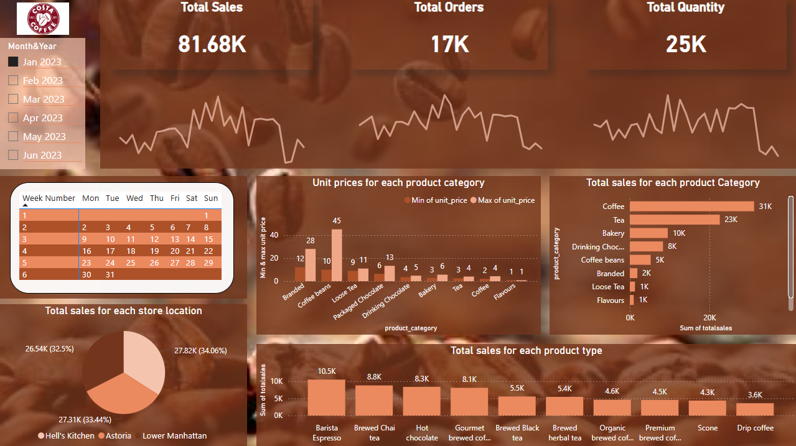

#  Coffee Sales Analysis Dashboard - Power BI & SQL  

##  Overview  
The **Coffee Sales Analysis Dashboard** is a **data-driven business intelligence solution** developed using **Power BI** with **SQL preprocessing** to analyze key sales performance indicators. This project provides insights into **total sales, orders, pricing trends, store performance, and product category analysis** to help businesses make **data-driven decisions**.  

## Objectives  
- Monitor **total sales, orders, and quantity sold** over different time periods.  
- Identify **best-selling product categories and top-performing store locations**.  
- Analyze **pricing distribution** across different coffee products.  
- Provide **actionable insights** through **interactive Power BI visualizations**.  
- Optimize data processing by **cleaning and aggregating raw sales data using SQL** before visualization.  

##  Key Insights  
- **Total Sales:** **$81.68K**  
- **Total Orders:** **17K**  
- **Total Quantity Sold:** **25K**  
- **Top-Selling Product Category:** **Coffee ($31K in sales)**  
- **Store Performance:** Sales distributed among **Hell's Kitchen, Astoria, and Lower Manhattan** locations.  
- **Pricing Insights:** **Coffee beans have the highest price range ($10 - $45), followed by branded coffee ($12 - $28). Flavors & tea are on the lower end**.
- **Top-Selling Products:** **Barista Espresso, Brewed Chai Tea, Hot Chocolate, and Gourmet Brewed Coffee**.  

---
## Dashboard 

---

##  Technology Stack  
- **Power BI** – Data visualization & interactive dashboards.  
- **SQL** – Data preprocessing, transformation, and aggregation.  
- **Excel/CSV** – Initial data storage & export for analysis.  

---

### If you find this project useful, don’t forget to give it a star! ⭐ 

